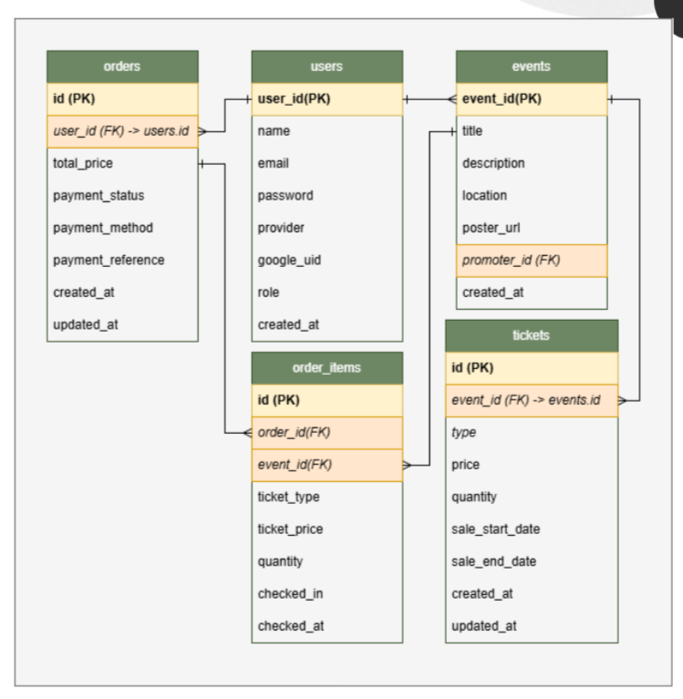

# Penjelasan Skema Database

Dokumen ini menjelaskan struktur tabel dan relasi pada skema database aplikasi. Gambar skema dapat ditambahkan pada bagian **Gambar Skema Database** di bawah.

## Gambar Skema Database

## Ringkasan Entitas

### 1. `users`
Menyimpan data pengguna.

**Kolom utama:**
- `user_id` (PK)
- `name`
- `email`
- `password`
- `provider`
- `google_uid`
- `role`
- `created_at`

### 2. `events`
Menyimpan informasi event yang dibuat oleh promotor.

**Kolom utama:**
- `event_id` (PK)
- `title`
- `description`
- `location`
- `poster_url`
- `promoter_id` (FK → `users.user_id`)
- `created_at`

### 3. `tickets`
Menyimpan detail tiket yang tersedia untuk event tertentu.

**Kolom utama:**
- `id` (PK)
- `event_id` (FK → `events.event_id`)
- `type`
- `price`
- `quantity`
- `sale_start_date`
- `sale_end_date`
- `created_at`
- `updated_at`

### 4. `orders`
Menyimpan data transaksi pemesanan tiket oleh pengguna.

**Kolom utama:**
- `id` (PK)
- `user_id` (FK → `users.user_id`)
- `total_price`
- `payment_status`
- `payment_method`
- `payment_reference`
- `created_at`
- `updated_at`

### 5. `order_items`
Menyimpan detail item dalam setiap pesanan.

**Kolom utama:**
- `id` (PK)
- `order_id` (FK → `orders.id`)
- `event_id` (FK → `events.event_id`)
- `ticket_type`
- `ticket_price`
- `quantity`
- `checked_in`
- `checked_at`

## Relasi Antar Tabel

- **`users` → `events`**: satu pengguna (promotor) dapat membuat banyak event.
- **`events` → `tickets`**: satu event memiliki banyak tipe tiket.
- **`users` → `orders`**: satu pengguna dapat membuat banyak pesanan.
- **`orders` → `order_items`**: satu pesanan memiliki banyak item.
- **`events` → `order_items`**: item pesanan terkait dengan event tertentu.
