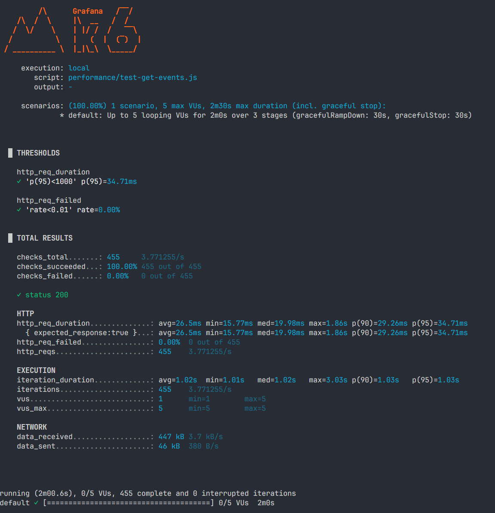
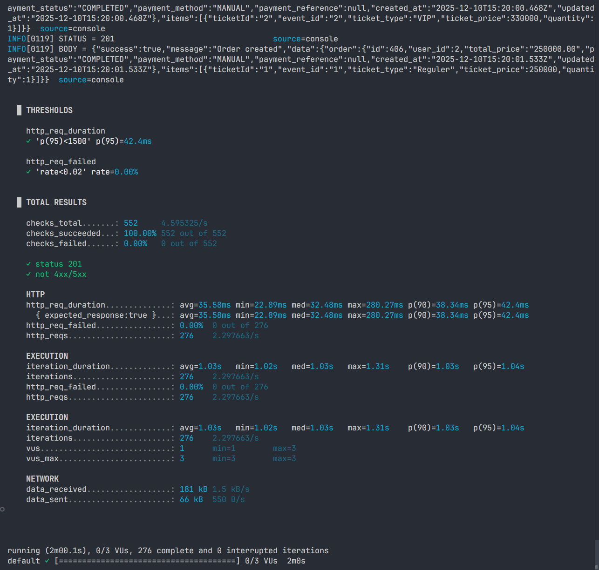
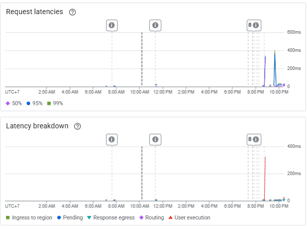
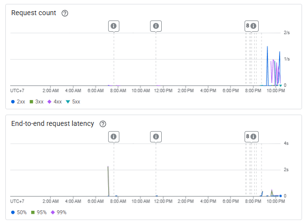

# Performance Testing Report

## Tujuan
Mengukur latensi, throughput, dan error rate backend saat menerima load.

## Environment
- Platform: Cloud Run (asia-southeast1)
- Service: tugas-besar-cloud-computing
- Tool: k6 lokal
- Waktu test: _isi tanggal/jam_

## Skenario
1. **GET /api/events**
   - Stages: 0→5 VUs (30s), hold 5 VUs (1m), ramp down (30s)
2. **POST /api/buyer/checkout**
   - Stages: 0→3 VUs (30s), hold 3 VUs (1m), ramp down (30s)

## Hasil k6
### GET /api/events
- RPS rata-rata: **3.77 req/s**
- Latency avg: **26.5 ms**
- p95 latency: **34.71 ms**
- Error rate: **0.00% (0 dari 455 request)**
- Screenshot output k6:
  -

### POST /api/buyer/order
- RPS rata-rata: **2.30 req/s**
- Latency avg: **35.58 ms**
- p95 latency: **42.4 ms**
- Error rate: **0.00% (0 dari 276 request gagal)**
- Screenshot output k6:
  - 

## Hasil Observability GCP
- Screenshot latency Cloud Run: 
  - `

- Screenshot request count: 
  - 

